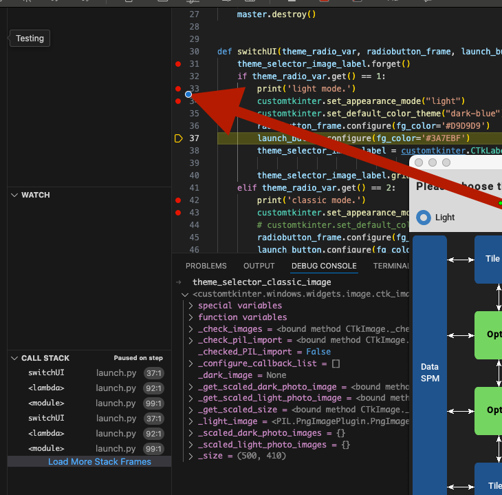

# Mac remote debugging instructions


Developer shall be able to debug this repository's source code via VsCode installed in host machine. Below are some troubleshoot tips.


## debugging steps


1. Install [Docker extension](https://code.visualstudio.com/docs/devcontainers/containers) from microsoft in VsCode


2. Start the docker container inside VsCode

3. Open the python file and start debugging via clicking Run/Debug button


## common issues


#### 1. ```xauth command not found```

MacOS is missing XQuartz dependency

```
# install XQuartz
brew install --cask xquartz
# open XQuartz
open -a XQuartz
```

#### 2. ```_tkinter.TclError: couldn't connect to display 10.0.0.204:xxx (Display not setup correctly)```

This can be happening for multiple reasons, including cross device display permission is not granted, display is not automatically being setup in MacOS. Try below steps:

> Enable all access on host machine
```
xhost +
```

> Confirm display in host machine

```
echo $DISPLAY
```

> If display is empty or invalid, set a random display number in host machine

```
export DISPLAY=:0
```

> And modify the scripts to assign 0 as DISP_NUM (run_mac_docker.sh line 8)

```
DISP_NUM=0
```


#### 3. in VsCode terminal, an error of ```Display xx.xx.xx.xx is not found```

This is because VsCode's ssh terminal does not share the same enviorment variable with the docker container, can be resolved via manually setting the display ip and port number (same as the one from docker container)

run ```export DISPLAY=xxx.xxx.xxx.xxx``` in the VsCode terminal


#### 4. When setting break points and debug, an error of ```ImportError: can not import name 'Literal' from 'typing'```


This is because the container is running python 3.7 for the programme, however the VsCode ssh plugin is running its own python debug tool (debugpy) for python 3.8 enviorment. Can be resolved via force to install a lower version of debugpy.

> install a lower version of debugpy

```pip install debugpy==1.6.6```

> force remove the vscode's debugpy

```rm -rf /root/.vscode-server/extensions/ms-python.debugpy-2025.0.1-linux-x64/bundled/libs/debugpy```

>system link the old debugpy to replace VsCode's 

```ln -s /WORK_REPO/venv/lib/python3.7/site-packages/debugpy /root/.vscode-server/extensions/ms-python.debugpy-2025.0.1-linux-x64/bundled/libs/debugpy```


## Happy debugging!


